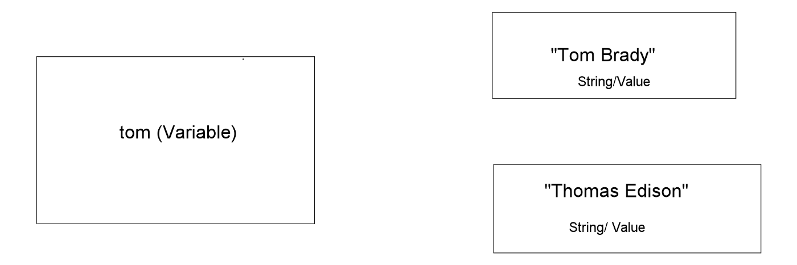
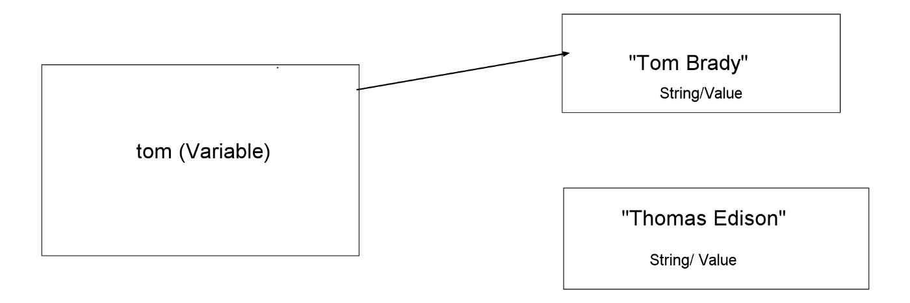
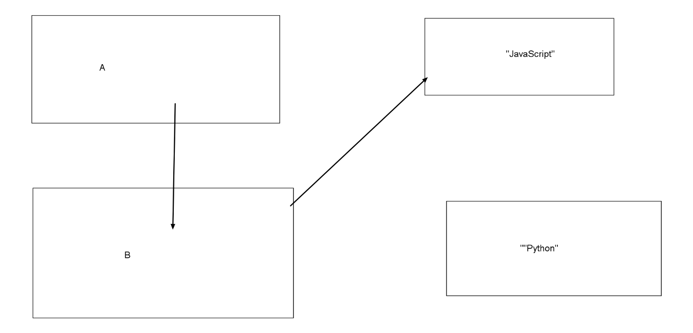
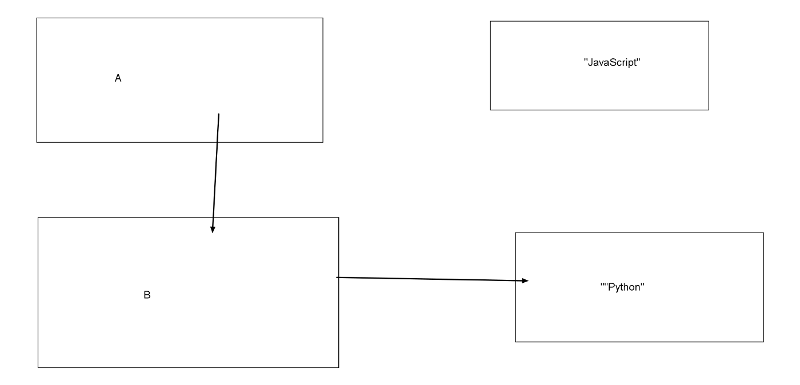
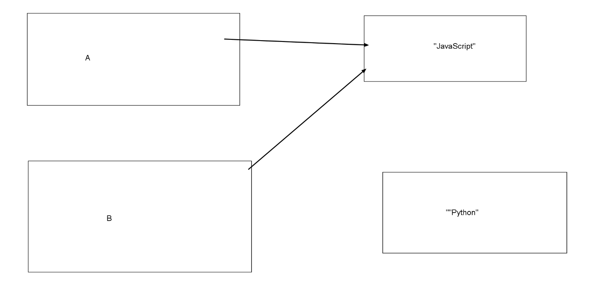

Hey all, So a lot of people coming into JavaScript, struggle with identifying with certain ideas that can look contradictory. In reality, anytime you see what appears to not make sense, best practice is to sit down and work on understanding the root issue, the why, and the how.

Run this piece of JavaScript in your console.

```js
// Create variable pointing to an array
let test_array = ["good morning","life is good"]

// Mutate(change) the first element of the array
test_array[0] = "how's life"

// Mutated element is persisted
test_array  //  (2) ["how's life", "life is good"]
```
In this piece of code, we simply grab an array and change the value of the first element of the array.

Now run this piece of code.

```js

// set variable name to string 
let name = "Rob Gronkowski"

// Access first element of variable 
name[0]  // "R"

// Mutate element to equal "Bob Gronkowski"
name[0] = 'B' 
name // "Rob Gronkowski" 
```
Uh whaatttt?? In both cases you can read a specific element of the string/array, but only in the case of the array are you able to change the aforementioned element.

What’s JavaScripts deal? Well, it’s all in how JavaScript perceives a string and an array. There are 8 data types, 7 of which are primitive and 1(Object) which is non-primitive. Those 7 are Boolean, Null, undefined, string, integer, BigInt, and symbol. In essence, any primitive data type has no rights. They cannot be changed or affected in any way. (You can add 2 primitive types together but cannot mutate its value. For example, try creating an array and modify the length. Then try with a string.)

So to remember

*** Primitive values are read-only**

*** Only Objects can be mutated**

---


Now that primitive values cannot be changed in any sort of way, let’s try something else.

```js
// Set variable to string
let tom = "Tom Brady" // undefined

Check value of tom
tom // "Tom Brady"

Change value of tom
tom = "Thomas Edison" // "Thomas Edison"

Check value of tom 
tom // "Thomas Edison"
????!!!
```

Whatt??? I thought strings couldn’t be changed!! You’re right. They can’t be changed. In this case, we aren’t changing the string, we are merely re-assigning the variable. A variable is not any form of data-type of its own, it is just a pointer to show us a piece of data that we have created. Over here we haven’t destroyed “Tom Brady”.[¹] The Patriots still need him.[²] We are however taking the variable of “tom” and assigning it to the string of “Thomas Edison”. By doing so, however, we no longer have a way to access “Tom Brady”, and in essence, that string is lost to us.

Think of it this way.



Everyone is on their own in these very plain-looking boxes. Like this guy here.


We set the variable “tom” to show us the string of “Tom Brady”.



Now “tom” is assigned to the string of “Thomas Edison”.


As you can see, nothing happened to “Tom Brady”. He didn’t become mutated in any way, rather the variable points to a different value.

---
<br>

This helps explain how variables work if one is assigned to another.
```js
let b = "JavaScript" 
let a = b
```
In this case, a points to the value of b, not to b itself, so if I would change the value of variable-b to “Python”, variable-a would still point to the value of “JavaScript”

```js
a // "JavaScript"
b // "JavaScipt"
let b = "Python"
b // "Python"
a // "Javascript"
```

Again, just for clarity using awwapp(great tool!).
If a became b, then whenever b changes, a would become whatever b became.



So when a becomes “Python”, b would too.



However JavaScript is pass-by-value, and a just takes on the value of whatever b is at the time of assignment and has nothing to do with b afterward.



<br>

---

To anyone who reads this blog, I hope some of this helps you in your journey to understanding the how and why of JavaScript. A lot of the ideas written here, I understood much better than earlier from reading Dan Abramov’s Just JavaScript newsletter, which I can’t recommend enough. I posted a link to subscribe to the bottom of this page.

P.S. Just as a reminder, what do you think this function does to the string? Remember strings are primitive.

```js
const string = 'hello'
function addWordsToString(x) { 
  x = x + "world"
return x
}
string // ???
```


[^1]. JS does have garbage collection and therefore if something is uselessly taking up space in memory, it will be deleted.
[^2]. Of course, Brady is coming back, absolutely ridiculous to think there is any chance he’s going anywhere else, the best chance of ring no.7 is Foxborough. (Of course, if he does leave, I never said this. )   
EDIT: I never said this

---
<br>

Here are some links to sites mentioned earlier
> [Just JavaScript](https://justjavascript.com/).

> [Awwapp](https://awwapp.com/).

