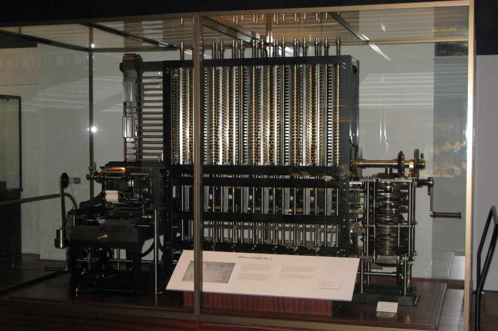
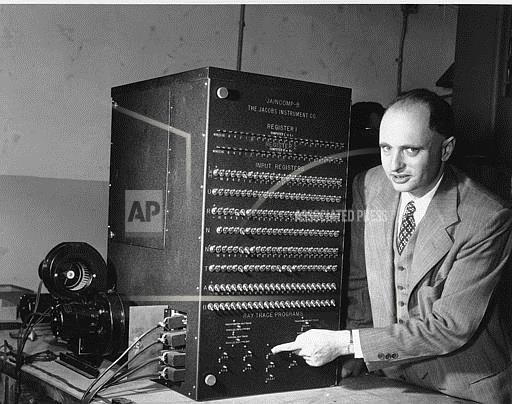

Hey all, to understand a subject, I always think it’s important to know the history behind said subject, and who helped form it. So much of the knowledge we have today is thanks to the generations before us, who worked to bring us to where we are today. So I decided to do some research into the history of programming languages and the people who first communicated with the engineering marvel we know today as a computer. I’ll try to keep these profiles brief and to the point as much as possible.

---
## Ada Lovelace: First Computer Program

Ada Lovelace was born Augusta Ada Byron, in London on December 10, 1815 to Lord and Lady Byron. Her father, the Lord Byron, was a famed English poet known for his writings as well as his work in the Greek War of Independence, which made him a revered figure in Greece. In 1835, Ada married William King-Noel, who in 1838 became the first Earl of Lovelace, and thereupon took on the title, Countess of Lovelace.

Though mathematics and science were not standard teaching to girls in that time period, Lady Byron encouraged her gifted daughter to pursue such subjects in order to avoid her father’s “insanity”(the Lord and Lady seperated when Ada was very young). Through her interest in logic and inventions, Ada developed friendships with many of the great minds of the day in Britain. Counted among Ada’s many scientific friends was the inventor and mechanical engineer, Charles Babbage, considered today to be the father of the computer. In 1833, Babbage started work on his most famous achievement, the Analytical Engine¹, generally considered the world’s first computer. The Analytical Engine, though incorporating many of the ideas we use in computer programming today, such as integrated memory, conditional logic and loops, was only intended for algorithms and other mathematical equations.

In 1843 Ada was asked to translate a French article on the Engine into English. Her translation included her personal notes, which were 3 times as long as the actual article she was translating. These notes are most famous for Note G², in which Ada describes an algorithm that the machine could carry out. This algorithm is widely considered to be the world’s first actual computer program. Ada also saw the future of programming, that one day, actual words would replace numbers, that once numbers could be read by a machine and interpreted, so too might any other form of information.

>“Supposing” she wrote, “that the fundamental relations of pitched sounds in the science of harmony and of musical composition were susceptible of such expression and adaptations, the engine might compose elaborate and scientific pieces of music of any degree of complexity or extent.”

Ada was not widely known for her own achievements during her lifetime, in fact after she died, most obituaries just spoke about her father. It wasn’t until a century later when Alan Turing wrote his essay titled ‘Computing machinery and intelligence’, and argued against some of Ada’s ideas, that Ada became widely known in the scientific world³.

Today, millions of people write software programs, and Ada Lovelace is credited by most to have written the very first one. Ada Lovelace Day is marked the second Tuesday of October, and the impact she had on the future of programming is immeasurable.

 
###### The Difference Engine invented by Charles Babbage was the precursor to his more widely known Analytical Engine.

---

### John Backus: Creating first widely used programming language

> Much of my work has come from being lazy. I didn’t like writing programs, and so, when I was working on the IBM 701, writing programs for computing missile trajectories, I started work on a programming system to make it easier to write programs.”

Born in Philadelphia in 1924, John Backus joined IBM in 1950, shortly after earning his Master’s from Columbia University. In 1950 programming consisted of a sequence of numbers which in turn ran a very basic function, for example ‘add the number in register A to the number in register B’. This made code very time-consuming and error-prone.

###### We’ve come a long way. (AP Photos)

> At the time, programming was exceedingly difficult-Backus once described it as “doing hand-to-hand combat with the machine⁴.”

In 1953, Backus proposed to create a language which once entered into the computer, would be translated into the numbers the computer understood. A few members of his team assembled at IBM were chess players, chosen because of the logic they were assumed to possess. It took 4 years to develop FORTRAN, but once it was released it became popular quickly. Chiefly because it reduced the amount of code you had to write by 20 times.

Today FORTRAN is still used for large scale numerical computations. For most of us its importance cannot be undermined. FORTRAN was the first widely used programming language and opened the doors for all the languages that followed. Thanks to John Backus and his team at IBM, we can sit and learn JavaScript, Ruby, or Python.

Of course there are so many more people that created and pioneered programming and computers the way we know them today, this is just a glimpse into 2 of the people that shaped history. I would like to end this article with a quote from Nikola Tesla in 1926, which is a reminder that everything we have today is thanks to the people that came before us.

> Nikola Tesla: “When wireless is perfectly applied the whole earth will be converted into a huge brain, which in fact it is, all things being particles of a real and rhythmic whole. We shall be able to communicate with one another instantly, irrespective of distance. Not only this, but through television and telephony we shall see and hear one another as perfectly as though we were face to face, despite intervening distances of thousands of miles; and the instruments through which we shall be able to do his will be amazingly simple compared with our present telephone. A man will be able to carry one in his vest pocket.”

---

¹ The Analytical Engine was never actually built

² Ada’s notes http://www.fourmilab.ch/babbage/sketch.html

³ Though she predicted many future inventions and uses of the computer, in Note G, Ada strongly makes clear that the machine does not have the power to innovate and can only work with what information we have given it. Essentially arguing against the idea of Artificial Intelligence(AI).

⁴ https://www.computerhistory.org/fellowawards/hall/john-backus/

