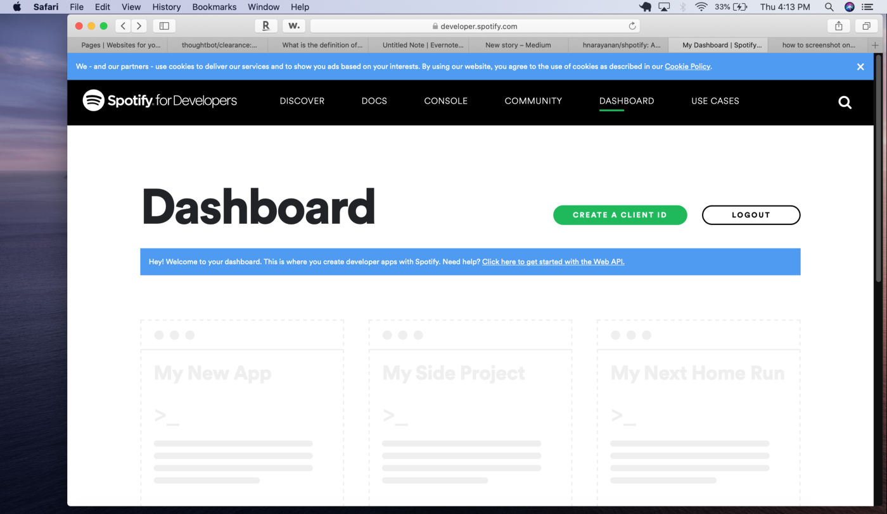
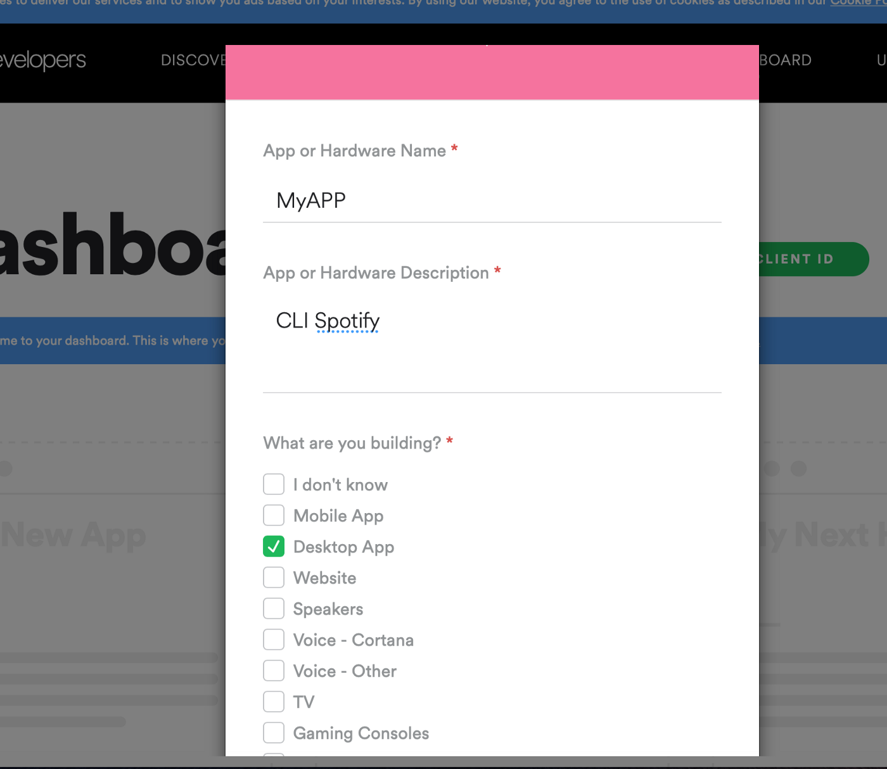

Who has always dreamed of being able to play music straight from your terminal without having to move your cursor? To be able to explore that vast jungle of artists and genres, to block out all of that disrupting, outside noise with the sound of music, all while in middle of creating the next Facebook?

Aha. Interesting. Well if you have, read on, if not, well, read on anyway.

So for all you techies who would like to use this useful tool, I have news for you. You can do all that.

<!-- Pure Shock gif -->

The first step is to install the Spotify desktop app. https://www.spotify.com/us/download/other/ (Honestly you could’ve googled that but I’m going to put everything here anyways, thank me later.)

Next step input this into your terminal.

```rb
brew install shpotify
```

Note: If you don’t have Home-brew, what are you doing trying to download a CLI app? Download Home-brew ASAP. https://brew.sh

Now Shpotify (yes the developers named it Shpotify) will work right away as in, you can play and stop songs and many other features from your CLI already, but you can’t search or play a specific song, which is pretty stupid to have a music player from your CLI if you can’t choose the song. So let’s become Spotify Developers!!!!!!!

<!-- Awesomeness Pic of Bautista -->

Go to spotify.com, scroll to the bottom, find where it says developers and click that. You can also just go to this link https://developer.spotify.com. Log in to your Spotify account, and go to the dashboard.

 

Click Create Client ID, and fill in some info.

 

Don’t worry too much about what you’re filling in, then select you are not trying to monetize ie. make money with your app, Gee Spotify needs to calm down. Check all the boxes and voila, you are a Spotify Developer!! 
Give yourself a pat on the back.

Now if you’re looking at this page saying “What in the world am I doing?”, can I destroy Spotify, am I going to jail for this? Don’t worry you’re probably not going to do anything to Spotify, about the jail part, I can’t guarantee anything. Just don’t talk about this and you’ll be fine.

Moving on. You should see something that says Client ID with a long number in front of it and underneath that it says “Show Client Secret”, Click “Show Client Secret”.

It should look similar to this

```rb
CLIENT_ID="abc01de2fghijk345lmnop"
CLIENT_SECRET="qr6stu789vwxyz"
```

copy that and go on and paste it here in your shpotify file

```rb
${HOME}/.shpotify.cfg
```

By the way, you are not supposed to share that secret, something to be aware of (Honestly). For more info on that check out this blog.

https://medium.com/better-programming/how-to-hide-your-api-keys-c2b952bc07e6

Now go to your terminal, you can be in any directory or file and try Spotify play!! There’s actually a ton of commands you can try

```
spotify play                       Resumes playback where Spotify last left off.
spotify play <song name>           Finds a song by name and plays it.
spotify play album <album name>    Finds an album by name and plays it.
spotify play artist <artist name>  Finds an artist by name and plays it.
spotify play list <playlist name>  Finds a playlist by name and plays it.
spotify play uri <uri>             Play songs from specific uri.
spotify next                       Skips to the next song in a playlist.
spotify prev                       Returns to the previous song in a playlist.
spotify replay                     Replays the current track from the beginning.
spotify pos <time>                 Jump to a specific time (in seconds) in the current song.
spotify pause                      Pauses (or resumes) Spotify playback.
spotify stop                       Stops playback.
spotify quit                       Stops playback and quits Spotify.
spotify vol up                     Increases the volume by 10%.
spotify vol down                   Decreases the volume by 10%.
spotify vol <amount>               Sets the volume to an amount between 0 and 100.
spotify vol [show]                 Shows the current volume.
spotify status                     Shows the play status, including the current song details.
spotify status artist              Shows the currently playing artist.
spotify status album               Shows the currently playing album.
spotify status track               Shows the currently playing track.
spotify share                      Displays the current song's Spotify URL and URI.
spotify share url                  Displays the current song's Spotify URL and copies it to the clipboard.
spotify share uri                  Displays the current song's Spotify URI and copies it to the clipboard.
spotify toggle shuffle             Toggles shuffle playback mode.
spotify toggle repeat              Toggles repeat playback mode.
```

Yeah, Awesome.

I stumbled on this while trying to add music to my CLI project during the very beginning of my time at Flatiron School. While I was very frustrated at the time trying to incorporate Spotify into my project, It is a cool, and useful feature. (EDIT: After writing this blog, I found out that you can import CLI commands into your code, by just writing the prefix of system inside your code. Like this for example.
```rb
system "spotify play"
```

Just remember to add the ability or function to stop as well.)

Please check out Shpotify on Github. These guys are great. https://github.com/hnarayanan/shpotify
Anyways hope you all enjoy and enjoy coding!

